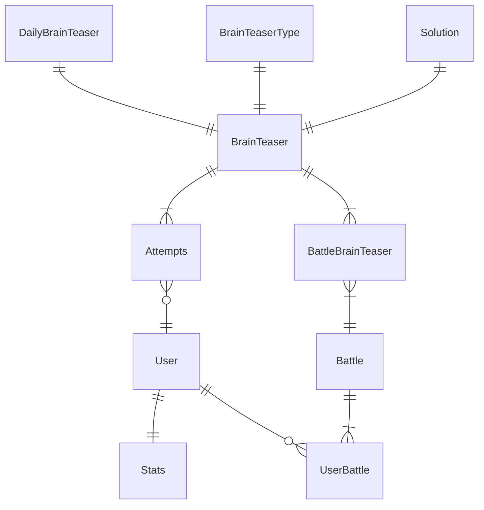
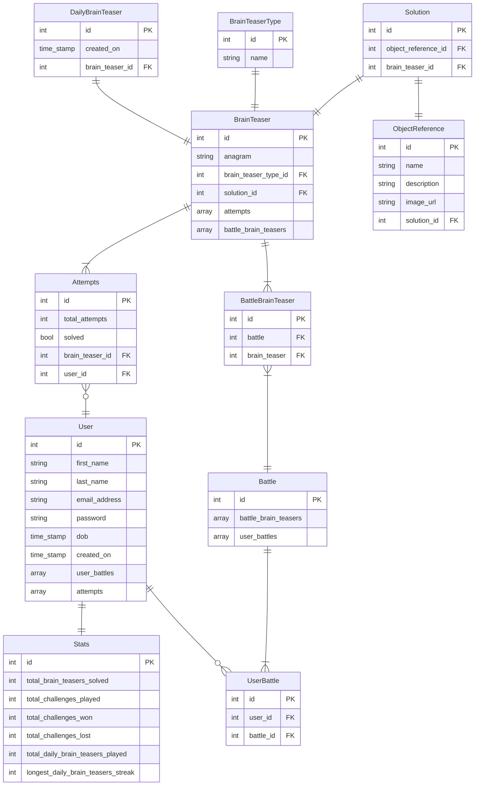

# Bananagrams

## What is the application?

An e-learning app designed to improve the pattern recognition and language skills of children.

The app is based around two themes. A brain teaser, the anagram, and tropical fruit. Designed to aid in the brain development of children by presenting users with anagrams of tropical fruit.

Using gamification, the intent is bi-functional in that it will promote language development and encourage an interest in fruit by showcasing the wierd and wonderful world of tropical fruit, sharing images of their peculiar shapes along with descriptions of their enticing, and often strange, flavours.

## Why

Getting children excited about both learning and eating healthy can be challenging. This app is designed to tackle both in an intriguing and rewarding manner through the gamification of the app.

## MVP

- User account creation/login
- Connect to the tropicalfruitandveg.com API
- Auto-generate an anagram a day of a random fruit/veg from the API
- Allow users 5 attempts to unscramble the anagram of the day
- Users can view/share their stats
- Users can view other user's stats
- Users can face off on a set of anagrams (set a custom anagram length for difficulty)

## Stretch Goals

- Allow users to create their own anagrams for friends to solve
- Allow users to comment on user generated anagrams after complete (hide comments until complete)
- Expand to other topics (capital cities, history, books, art etc)

## Domain Model

## Entity Relationship Diargram

