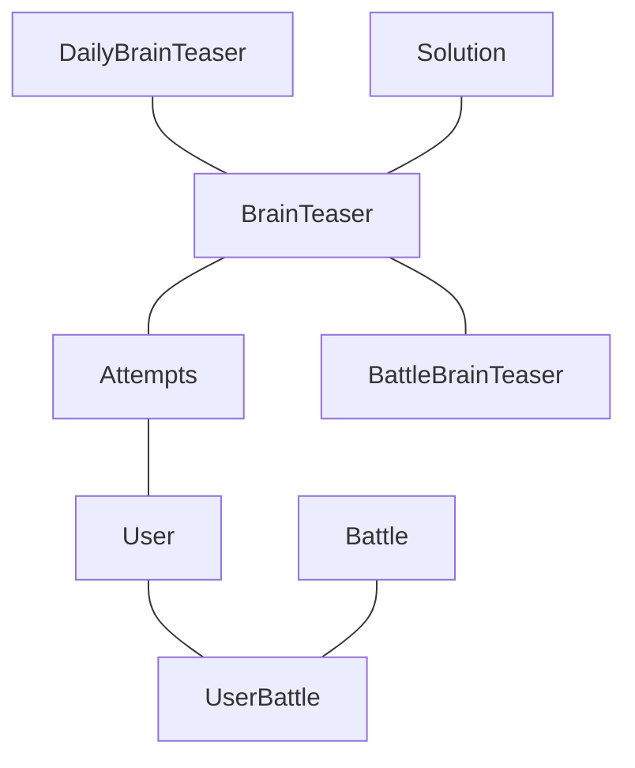
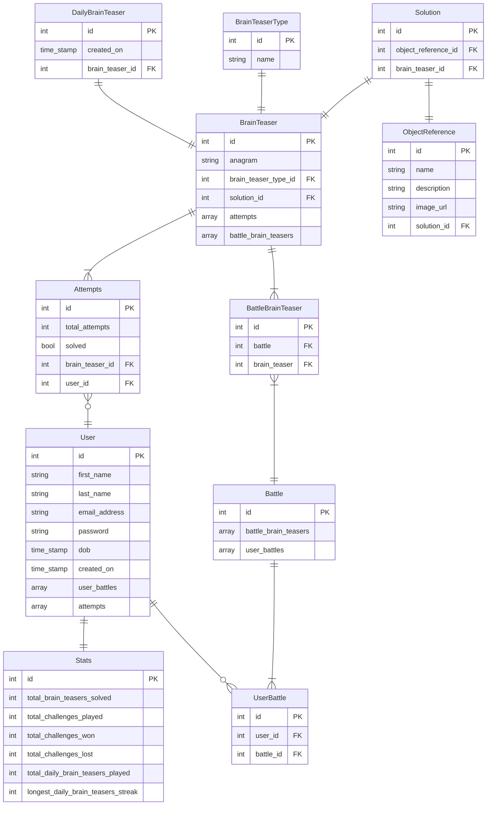
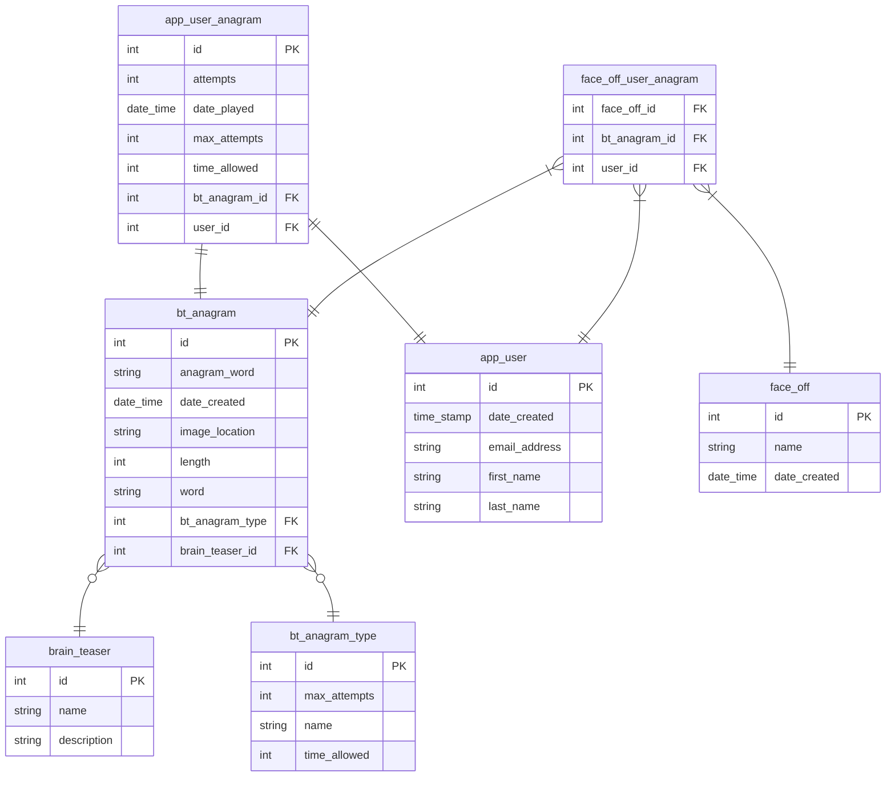
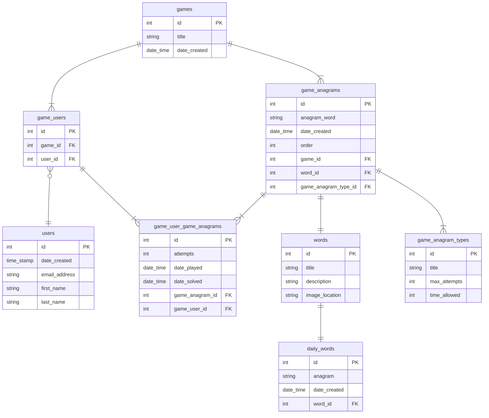

# Bananagrams

## What is the application?

An e-learning app designed to improve the pattern recognition and language skills of children.

The app is based around two themes. A brain teaser, the anagram, and tropical fruit. Designed to aid in the brain development of children by presenting users with anagrams of tropical fruit.

Using gamification, the intent is bi-functional in that it will promote language development and encourage an interest in fruit by showcasing the wierd and wonderful world of tropical fruit, sharing images of their peculiar shapes along with descriptions of their enticing, and often strange, flavours.

## Why

Getting children excited about both learning and eating healthy can be challenging. This app is designed to tackle both in an intriguing and rewarding manner through the gamification of the app.

## MVP

- User account creation/login
- Connect to the tropicalfruitandveg.com API
- Auto-generate an anagram a day of a random fruit/veg from the API
- Allow users 5 attempts to unscramble the anagram of the day
- Users can view/share their stats
- Users can view other user's stats
- Users can face off on a set of anagrams (set a custom anagram length for difficulty)

## Stretch Goals

- Allow users to create their own anagrams for friends to solve
- Allow users to comment on user generated anagrams after complete (hide comments until complete)
- Expand to other topics (capital cities, history, books, art etc)

## Domain Model


<!--
## Entity Relationship Diargram v1



## Entity Relationship Diargram v2


-->

## Entity Relationship Diargram v3



<!--
## API Specifications v1

### Users

`GET /users` 
###### Returns a list of users

Response: `200 OK`
```json
[
  {
    "id": 1,
    "date_created": "2023-01-11 10:27:21.240752",
    "email_address": "sean.currie@unosquare.com",
    "first_name": "Sean",
    "last_name": "Currie",
    "username": "seancurrie"
  },
  {
    "id": 2,
    "date_created": "2023-01-11 10:28:21.240752",
    "email_address": "sean.currie+david@unosquare.com",
    "first_name": "David",
    "last_name": "Currie",
    "username": "davidcurrie"
  }
]
```

---

`GET /users?user-name={name}` 
###### Returns a list of users based on search word

Response: `200 OK`
```json
[
  {
    "id": 1,
    "date_created": "2023-01-11 10:27:21.240752",
    "email_address": "sean.currie@unosquare.com",
    "first_name": "Sean",
    "last_name": "Currie"
    "username": "seancurrie"
  },
  {
    "id": 2,
    "date_created": "2023-01-11 10:28:21.240752",
    "email_address": "sean.currie+david@unosquare.com",
    "first_name": "David",
    "last_name": "Currie"
    "username": "davidcurrie"
  }
]
```

---

`GET /users/{id}` 
###### Returns a user

Response: `200 OK`
```json
{
    "id": 1,
    "date_created": "2023-01-11 10:27:21.240752",
    "email_address": "sean.currie@unosquare.com",
    "first_name": "Sean",
    "last_name": "Currie"
    "username": "seancurrie123"
  }
```

---

`POST /users`
###### Creates a user

Request:
```json
  {
    "email_address": "sean.currie+john@unosquare.com",
    "first_name": "John",
    "last_name": "Currie",
    "password": "password"
    "username": "johncurrie123"
  }
```

Response: `201 Created`

---

`PUT /users/{id}`
###### Updates user by id

Request:
```json
  {
    "email_address": "sean.currie+david@unosquare.com",
    "first_name": "David Mark",
    "last_name": "Currie Powder"
  }
```

Response: `200 OK`

---

`DELETE /users/{id}`
###### Deletes a user by id

Response: `200 OK`

---
---

### Anagrams

`GET /anagrams`
###### Return a list of anagrams

Response: `200 OK`
```json
[
  {
    "id": 1,
    "anagram_word": "NANABA",
    "anagram_length": 6,
    "anagram_solution": "BANANA"
    "date_created": "2023-01-11 10:30:21.240752",
    "image_location": "http://tropicalfruitandveg.com/images/bananauk2.jpg"
  },
  {
    "id": 2,
    "anagram_word": "NSPSAOI RIUTF",
    "anagram_length": 12,
    "anagram_solution": "PASSION FRUIT"
    "date_created": "2023-01-11 10:31:21.240752",
    "image_location": "http://tropicalfruitandveg.com/images/passionyel.jpg"
  }
]
```

---

`GET /anagrams/{id}`
###### Return an anagram

Response - `200 OK`
```json
{
    "id": 1,
    "anagram_word": "NANABA",
    "anagram_length": 6,
    "anagram_solution": "BANANA"
    "date_created": "2023-01-11 10:30:21.240752",
    "image_location": "http://tropicalfruitandveg.com/images/bananauk2.jpg"
  }
```

---

`POST /anagrams`
###### Create an anagram

Request:
```json
  {
    "anagram_word": "EHYLEC",
    "anagram_length": 6,
    "anagram_solution": "LYCHEE"
    "date_created": "2023-01-11 10:32:21.240752",
    "image_location": "http://tropicalfruitandveg.com/images/lychee2.jpg"
  }
```

Response: `201 Created`

---

`PUT /anagrams/{id}`
###### Update anagram by id

Request:
```json
  {
    "anagram_word": "CHEELY",
    "anagram_length": 6,
    "anagram_solution": "LYCHEE"
    "date_created": "2023-01-11 10:32:21.240752",
    "image_location": "http://tropicalfruitandveg.com/images/lychee2.jpg"
  }
```

Response: `200 OK`

---

`DELETE /anagrams/{id}`
###### Delete an anagram by id

Response: `200 OK`

---
---

### User Anagrams

`GET /users/{id}/user-anagrams`
###### Returns a list of anagrams attempted by a user

Response: `200 OK`
```json
[
  {
    "id": 1,
    "attempts": "3",
    "date_played": "2023-01-11 10:35:21.240752",
    "max_attempts": 5,
    "solved": true,
    "time_allowed": 0
  },
  {
    "id": 2,
    "attempts": "3",
    "date_played": "2023-01-11 10:36:21.240752",
    "max_attempts": 3,
    "solved": false,
    "time_allowed": 30
  }
]
```

---

`GET /users/{id}/user-anagrams/{id}`
###### Returns an anagram attempted by a user

Response: `200 OK`
```json
{
    "id": 1,
    "attempts": "3",
    "date_played": "2023-01-11 10:35:21.240752",
    "max_attempts": 5,
    "solved": true,
    "time_allowed": 0
  }
```

---

`POST /user/{id}/user-anagrams`
###### Creates a record of a user's attempt at an anagram

Request:
```json
  {
    "attempts": "3",
    "max_attempts": 5,
    "solved": true,
    "time_allowed": 0
  }
```
Response: `201 Created`

---
---

### Face Offs

`GET /users/{id}/face-offs/{id}`
###### Gets a face off by an id

Response: `200 OK`
```json
  {
    "id": 1,
    "title": "Sean Vs David",
    "user_anagrams":
      [
        {
          "user_id": "1",
          "anagram_id": "1"
        },
        {
          "user_id": "2",
          "anagram_id": "1"
        },
        {
          "user_id": "1",
          "anagram_id": "2"
        },
        {
          "user_id": "2",
          "anagram_id": "2"
        },
        {
          "user_id": "1",
          "anagram_id": "3"
        },
        {
          "user_id": "2",
          "anagram_id": "3"
        }
      ]
  }
```
---

`POST /face-offs`
###### Creates a competitive face off challenge

Request:
```json
  {
    "title": "Sean Vs David"
    "user_ids":
    [
      {
        "user_id": 1
      },
      {
        "user_id": 2
      }
    ]
  }
```

Response: `201 Created`

---
---
-->

## API Specifications v2

### Users

`GET /users` 
###### Returns a list of users

Response: `200 OK`
```json
[
  {
    "id": 1,
    "date_created": "2023-01-11 10:27:21.240752",
    "email_address": "sean.currie@unosquare.com",
    "first_name": "Sean",
    "last_name": "Currie",
    "username": "seancurrie"
  },
  {
    "id": 2,
    "date_created": "2023-01-11 10:28:21.240752",
    "email_address": "sean.currie+david@unosquare.com",
    "first_name": "David",
    "last_name": "Currie",
    "username": "davidcurrie"
  }
]
```

---

`GET /users?user-name={name}` 
###### Returns a list of users based on search word

Response: `200 OK`
```json
[
  {
    "id": 1,
    "date_created": "2023-01-11 10:27:21.240752",
    "email_address": "sean.currie@unosquare.com",
    "first_name": "Sean",
    "last_name": "Currie"
    "username": "seancurrie"
  },
  {
    "id": 2,
    "date_created": "2023-01-11 10:28:21.240752",
    "email_address": "sean.currie+david@unosquare.com",
    "first_name": "David",
    "last_name": "Currie"
    "username": "davidcurrie"
  }
]
```

---

`GET /users/{id}` 
###### Returns a user

Response: `200 OK`
```json
{
    "id": 1,
    "date_created": "2023-01-11 10:27:21.240752",
    "email_address": "sean.currie@unosquare.com",
    "first_name": "Sean",
    "last_name": "Currie"
  }
```

---

`POST /users`
###### Creates a user

Request:
```json
  {
    "email_address": "sean.currie+john@unosquare.com",
    "first_name": "John",
    "last_name": "Currie",
    "password": "password"
  }
```

Response: `201 Created`

---

`PUT /users/{id}`
###### Updates user by id

Request:
```json
  {
    "email_address": "sean.currie+david@unosquare.com",
    "first_name": "David Mark",
    "last_name": "Currie Powder"
  }
```

Response: `200 OK`

---

`DELETE /users/{id}`
###### Deletes a user by id

Response: `200 OK`

---
---

### Games

`GET /users/{id}/games`
###### Gets a list of all games for a user

Response: `200 OK`
```json
  {
    [
      {
        "game_id": 1,
        "title": "Sean Vs David",
        "date_created": "2023-01-11 10:32:21.240752",
        "game_type": "Face Off",
        "game_users":
          [
            {
              "game_user_id": 1
            },
            {
              "game_user_id": 2
            }
          ]
        "games_anagrams":
          [
            {
              "game_anagram_id": "1",
              "anagram_word": "ANANAB",
              "anagram_solution": "BANANA",
              "max_attempts": 3,
              "order": 1,
              "timer": 30
            },
            {
              "game_anagram_id": "1",
              "anagram_word": "ANANAB",
              "anagram_solution": "BANANA",
              "max_attempts": 3,
              "order": 1,
              "timer": 30
            },
            {
              "game_anagram_id": "1",
              "anagram_word": "ANANAB",
              "anagram_solution": "BANANA",
              "max_attempts": 3,
              "order": 1,
              "timer": 30
            }
          ]
      },
      {
        "game_id": 2,
        "title": "Daily Anagram",
        "date_created": "2023-01-11 10:32:21.240752",
        "game_type": "Daily",
        "game_users":
          [
            {
              "game_user_id": 1
            }
          ]
        "games_anagrams":
          [
            {
              "game_anagram_id": "1",
              "anagram_word": "ANANAB",
              "anagram_solution": "BANANA",
              "max_attempts": 3,
              "order": 1,
              "timer": 30
            }
          ]
      }
    ]
  }
```

---

`GET /users/{id}/games/{id}`
###### Gets a competitive face off game by an id

Response: `200 OK`
```json
  {
    "id": 1,
    "title": "Sean Vs David",
    "date_created": "2023-01-11 10:32:21.240752",
    "game_type": "Face Off",
    "game_users":
      [
        {
          "game_user_id": "1",
          "first_name": "Sean"
        },
        {
          "game_user_id": "2"
          "first_name": "David"
        }
      ],
    "game_anagrams":
      [
        {
          "game_anagram_id": "1",
          "anagram_word": "ANANAB",
          "anagram_solution": "BANANA",
          "max_attempts": 3,
          "order": 1,
          "timer": 30
        },
        {
          "game_anagram_id": "2",
          "anagram_word": "ANANAB",
          "anagram_solution": "BANANA",
          "max_attempts": 3,
          "order": 1,
          "timer": 30
        },
        {
          "game_anagram_id": "3",
          "anagram_word": "ANANAB",
          "anagram_solution": "BANANA",
          "max_attempts": 3,
          "order": 1,
          "timer": 30
        }
      ]
  }
```

---

`CREATE /users/{id}/games`
###### Creates a competitive game with another user

Request:
```json
  {
    "title": "Sean Vs David"
    "user_ids":
    [
      {
        "user_id": 1
      },
      {
        "user_id": 2
      }
    ],
    "number_of_anagrams": 3,
    "difficulty": "easy"
  }
```

Response: `201 Created`

---

`POST /user/{id}/games/{id}/guess/{id}`
###### Updates a record of a user's attempt at an anagram

Request:
```json
  {
    "attempts": "3",
    "solved": "2023-01-11 10:32:21.240752"
  }
```
Response: `200 Ok`

---
---

## Useful Commands

### Docker
docker compose up <br />
docker compose down <br />
docker volume prune --force <br />

### Github
git status <br />
git add . <br />
git commit -m "some message" <br />
git push <br />

---
---

## AWS & Github

### Github Action Secrets

AWS_ACCESS_KEY_ID <br />
AWS_SECRET_ACCESS_KEY <br />
DEV_DB_USER <br />
DEV_DB_PASSWORD <br />
DEV_DB_URL (i.e. jdbc:postgresql://login-java.cvyacp0tw1lq.eu-west-1.rds.amazonaws.com:5432/) <br />
API_DB_URL (i.e. Server=SomeDbUrl,5432;Database=DbName;User Id=admin;Password=password;) <br />

### AWS Resources

Database: RDS <br />
Server/backend: Lightsail <br />
UI/frontend: S3 <br />
DIstribution: Cloudfront <br />
IaC: Cloudformation <br />
